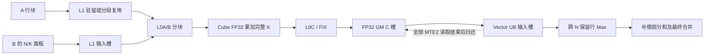

# TileLang 调度调研与 Ascend C 迁移方向

调研日期：2026-10-05。对照本项目 `e52738c`（R21 / S17，15/15 Pass）。本次只克隆并阅读官方源码、编译器变换及优化指南，没有修改执行代码，没有安装 TileLang、初始化子模块、编译 CANN 或运行 NPU，也没有新增线上成绩。

**主要结论：下一阶段应研究直接控制 Cube 数据流的持久 C/V 执行器，将输入驻留、分层缓冲和行归约所有权一起设计。** 我们已有逐块在线 Max、持久任务循环、双 GM C 槽和补偿部分和；这些不能重新包装成新优化。新机会主要在高层 Matmul 调用内部与调用之间：输入复用、L1/L0 搬运、Cube/FIX 重叠、C/V 交接及编译期几何。单独打开 `MixDualMaster` 不能自动获得这些机制。

用户转述群内讨论称线上可能为 910B，第一名曾让 AI 参考 TileLang 调度。前者提高 A2/910B 路线的调研优先级，后者提供学习线索；都不是官方机型证明或第一名源码证据。具体核数、资源和测试点 shape 仍不能据此确定，也不能承诺迁移后达到第一名。

## 1. 参考版本与阅读入口

两个官方仓库浅克隆在 `reference-repos/`，该目录已加入 `.gitignore`，不是本项目子模块，也不进入比赛提交或 GitHub 项目内容。未初始化大型依赖子模块。

| 仓库 | 分支及固定提交 | 本地位置 |
| --- | --- | --- |
| [tile-ai/tilelang](https://github.com/tile-ai/tilelang) | `d82101ff08acea8d3e3ca7d0ab40985a3ca2a781`，提交时间 2026-10-03 | `reference-repos/tilelang/` |
| [tile-ai/tilelang-ascend](https://github.com/tile-ai/tilelang-ascend) | `ascendc_pto`，`cbc67f2697e8ee18357adc447272691432b3948d`，提交时间 2026-09-30 | `reference-repos/tilelang-ascend/` |

主仓库用于理解 tile、layout、软件流水和任务排列；昇腾分支用于核对 A2/A3 的实际存储路径、指令和同步。主仓库新加入的 Ascend 950 路径，以及 CUDA 的 TMA、WGMMA、TMEM、warp/CTA 机制，都不能直接作为 910B 支持依据。

建议按这个顺序阅读；下方链接均固定提交，避免后续上游变化混淆证据。

| 资料 | 重点位置与价值 |
| --- | --- |
| [上游 FlashAttention][TL_FA] | 37–87 行：Q 复用、FP32 分数块、跨 N 在线行最大值、尾 N 的负无穷语义 |
| [上游软件流水说明][TL_PIPE] | 44–114 行：stage/order、数据依赖、预热／稳态／排空 |
| [上游流水变换][TL_INJECT] | 1208–1246、1473–1542 行：根据定义与最后使用决定缓冲版本 |
| [上游任务排列][TL_SCHEDULE] | 93–149 行：固定 worker、grid-stride、panel 与遍历方向 |
| [昇腾 CV 优化指南][ASC_GUIDE] | 108–230 行：L1 驻留、局部双缓冲、C/V 队列深度和同步间隔 |
| [昇腾专家 FA][ASC_EXPERT] | 104–202、257–315 行：各级容量分开管理，独立 Cube/Vector 循环，READY/FREE 交接 |
| [昇腾底层模板][ASC_COMMON] | 47–103、152–212、1185–1370 行：GM→L1、Mmad、Fixpipe、L0 分块和生命周期 |
| [昇腾代码生成][ASC_CODEGEN] | 755–795、977–1015、2714–2734 行：C/V 核映射、资源、gemm_v0 调用生成 |
| [昇腾流水说明][ASC_PIPE] | 81–160 行：跨核同步分组、嵌套流水限制、局部物理槽所有权 |
| [昇腾编译阶段][ASC_PHASE] | 99–122 行：workspace、跨核变换、流水、内存规划和同步的组合 |

## 2. 最贴题的计算结构是在线 MaxSim

上游 FlashAttention 先做一块 QK，再更新每行最大值。对于本题，可以去掉 softmax、指数归一化和第二次矩阵乘，只保留完整 K 点积、在线 Max(N)、最后 Sum(M)。这是一种数据流借鉴，不是照搬 FlashAttention 的整个算法。[源码][TL_FA]

以下是数学顺序示意，并非新的已实现 kernel：

```text
owner = (batch, M 行块, 可选的 N 分片)
row_max[有效行] = -inf
for 每个归属本 owner 的 N 块:
    C = FP32(0)
    for 全部 K 分块:
        按实际物理布局加载 A/B，向 C 累加
    排除无效 N 列
    row_max = max(row_max, reduce_max_N(C))

若 owner 覆盖全部 N：形成补偿部分和
若切分了 N：先跨分片逐行取 max，再形成补偿部分和
最终按确定顺序合并 M 方向部分和
```

**这一数学归约结构在我们的 Stream/Partials 中已经基本存在。** 需要补的是支撑它高效运行的低层调度，而不是再造一种同义的 Stream 路径。

几个不可交换的边界：全部 K 必须完成才能对 N 取 max；全部 N 分片的逐行 max 合并后才能对 M 求和；无效 K 输入置零，无效 N 结果必须排除或置负无穷，无效 M 行不进入 Sum。不能把 K 分块的 max 相加，也不能先对 M 求和再取 N 最大值。

## 3. 我们当前实现与 TileLang 参考的关键差异

### 3.1 高层 Matmul 调用与直接 Cube 数据流

当前 [kernel.asc](../kernel.asc) 和 [stream_matmul.asc](../stream_matmul.asc) 都创建默认 `Matmul<A,B,C>`，通过 `REGIST_MATMUL_OBJ` 使用 AIV 客户端与 AIC 服务。外层每个小块重复 SetOrgShape/SetSingleShape/SetTensor、IterateAll，以及 Wait/End；双槽路径最多有一次尚未结束的异步 Matmul 调用。

昇腾分支的 `T.gemm_v0` 由 codegen 生成 `tl::ascend::gemm_v0` 调用，模板显式将 L1 数据搬入 L0A/L0B，直接调用 `AscendC::Mmad`，经 `Fixpipe` 搬出 L0C。专家 FA 更直接组织这些操作。这条路径没有我们逐块使用的高层 Matmul server 会话。[代码生成][ASC_CODEGEN]、[底层实现][ASC_COMMON]

这并不说明 CANN Matmul 内部没有流水；它本来就会做内部 tiling 与缓冲。差异是我们目前没有显式控制跨调用的 A 驻留、内部层级的缓冲和循环顺序，而参考实现把这些作为调度的一部分。

**对上一轮建议的修订：** `MixDualMaster` 仍可作为减少消息机制成本的过渡对照；完整学习路线应进一步到直接 Cube tile 执行器。两者不是同一个实现，不能把设置一个布尔值等同于得到 TileLang 的调度。直接 Cube 版本同样需要严格同步，不能删除 Wait/End 后假定安全。

### 3.2 A 行块跨 N 驻留，而非反复建立独立乘法任务

专家 FA 在每个 owner 开始时加载 Q 到 L1，然后在 N 循环中只更新 K；部分配置还复用两份 L0A。对应本题，A 的一个 M 行块在扫描文档 N 时保持不变，适合按容量做驻留。[专家示例 164–202 行][ASC_EXPERT]

若一个 owner 处理 q 个 N 块，显式驻留可以把该 owner 的 A 面板装载从潜在的 q 次变为一次。这里只计算调度要求的逻辑装载，不断言当前 SDK 每次都造成相同 HBM 流量；缓存与 SDK 内部复用会改变实际成本。B 的装载、C 的搬运以及计算量也不会因此消失，所以 q 倍复用不等于算子快 q 倍。

完整 `BM×K` 放不下 L1 时，需要改变策略。若把 K-panel 放在外层并复用到多个 N 块，必须同时保留这些 N 块尚未完成的 FP32 C 累加器；L0C 容量可能成为新约束，或者需要额外 GM 部分结果。不能仅交换循环顺序就提前 Max。第一版可对资源适合的元数据使用驻留路径，其余沿用已有通用实现；适用条件必须基于容量与几何规则，不是测试点编号。

### 3.3 流水至少分四层，不能用一个 buffers 参数代表全部

| 层级 | 生产与消费 | 候选优化及约束 |
| --- | --- | --- |
| 输入到 L1 | MTE2 写，MTE1 读 | 不变 A 驻留；变化 B 分块预取；最后一次读完才能覆盖 |
| L1 到 L0A/B | MTE1 写，Cube 读 | 局部 ping-pong，隐藏下一次操作数加载 |
| L0C 到 GM | Cube 写，FIX 读 | 独立 C 槽及完成交接，重叠乘法与结果搬出 |
| GM 到 UB 再归约 | FIX 生产，MTE2 搬入，Vector 消费 | GM 环和 UB 输入槽分别管理，归约状态长期保留 |

专家 FA 的 `num_stages=14` 对应 GM workspace 的批深度，L0A/B/C 只有两份，大型 UB scratch 又有自己的数量。**14 是特定示例参数，不是我们的推荐默认值。** 迁移时分别选择 L1/L0/GM/UB 的槽数，逐层计资源。[专家示例 104–141 行][ASC_EXPERT]

我们现在的 GM 双槽只直接处理了第四层中 Cube 输出与 Vector 消费的重叠。R20 跨任务 carry 仍保留逐块 Matmul 会话；R21 则改进消费端 Max。两次改动都没有建立以上完整的数据流控制。

### 3.4 READY 与 FREE 是不同的依赖，释放时机也不同

每个物理 GM C 槽的协议应当是：

```text
Cube 等待 FREE → 写 C → FIX 完成 → 发 READY
Vector 等待 READY → 将所需 C 全部搬入 UB → 最后一次 MTE2 读完成 → 发 FREE
UB 继续做 Max，直到 Vector 读完才允许该 UB 槽重用
```

GM 槽不必因为 Max 仍在处理 UB 数据而一直占用。若 C 由多个 DMA 子块或两个 AIV 消费，必须等该槽所有消费者的最后一次读取完成后才能归还，不能读完第一个子块就覆盖。两侧还要处理首次 FREE、尾批有效数量、未使用槽和最终排空。[专家交接][ASC_EXPERT]、[所有权指南][ASC_OWNERSHIP]

参考实现支持每若干个结果发送一次通知，降低同步发令次数；代价是消费者更晚看到第一份数据，需要更多可容纳未消费结果的空间。初始实现宜逐块通知，再独立研究分组，不能同时把所有 stage 数和同步间隔放大。

理想稳态间隔接近各阶段耗时中的最大值，但这是模型，不是实测。增加槽数只能覆盖有限延迟和波动；若 Vector 持续比 Cube 慢，继续加槽不能消除吞吐瓶颈。短任务还可能因预热和排空变慢。

### 3.5 C/V 分工和物理布局属于同一个设计问题

专家 FA 用 `vid` 将 C 的 M 行分给两个 AIV，各自持有行状态；codegen 同时处理 AIV 的 block id、subblock id 和 1:1/1:2 kernel 类型。我们目前使用 1:1。[专家消费代码 284–315 行][ASC_EXPERT]、[codegen 755–785、977–984 行][ASC_CODEGEN]

两个 AIV 分担不同 M 行，可以研究减少单个 Vector 的负担，且不引入同一行 Max 的交换。但它不会把 Cube 算力翻倍，也不保证所有输入更快；核编号、空闲参与者、GM 槽释放、部分和布局和最终同步都必须一起改变。应作为单独变量，不与第一轮底层替换一起混入。

四种输入存储布局需要从 GM stride 到 L1 分形格式、再到 L0A/B 坐标完整匹配。TileLang 的 layout 表示逻辑坐标与物理位置／执行者的映射；手写版本仍要把这些映射明确下来。不能只抄 CUDA 的 FullRow/warp 参数，或者只在错误的物理搬运上切换 transpose 标志。

### 3.6 持久任务、任务重排与自动搜索要分开看

上游 persistent 使用固定 worker 与 `worker + j*num_workers` 领取任务，另用 panel/swizzle 改善局部性。我们的 grid-stride 循环已有持久任务分发的基本形式；仅把它改名为 persistent 不会新增性能。[上游任务调度][TL_SCHEDULE]

真正新增的选择是：同一 owner 覆盖哪些连续 N 块、哪些输入驻留、核间排列是否有利于 A/B 的缓存复用，以及最后一轮负载如何分配。小 batch、少 M 行块时，完整 N 所有权可能用不满核；仍需保留必要的 N 分片和先 Max 后 Sum 合并。

TileLang autotune 联合搜索 BM/BN/BK、stage、执行资源、遍历方式，而非只增大外层 tile；最终仍要校验与测时。[上游 autotune][TL_TUNE]

我们的 [joint_plan.h](../joint_plan.h) 用未校准的成本对候选排序，SDK 接受后返回，没有按实际内部 baseM/baseN/baseK 重新评估。未来候选要同时描述物理执行方案和资源，按规则生成有限的编译期 tile 模板，再通过公开 metadata 分派。不能在线 JIT、计时搜索、添加 launch 或根据猜测的官方点号选路径。本次不以额外 NPU 搜参为前置条件，也不把未测的模型称为最优调度。

## 4. 910B 路线中不能照抄的内容

**C 不会因为换成 TileLang 就自动绕过 GM。** 昇腾分支对非 A5 路径会引入 C/V workspace；专家 FA 也明确 L0C→GM workspace→UB。面向 A2/910B，当前有依据的目标是重叠这条路径、减少等待和完整矩阵生命周期，不能把 CUDA 的寄存器内 epilogue 等同于 Cube 结果直接在 UB 里。[workspace 变换][ASC_WS]、[专家示例][ASC_EXPERT]

**保持我们自己的数值要求。** 专家 FA 的 L0C 是 FP32，但 workspace_1/3 是 FP16；它还固定 FP16、dim=128、序列整块。基础 pipeline 示例有 FP32 workspace，可参考其类型选择。本题要保留 FP32 C→Max 和补偿 Sum，支持 BF16、四布局、尾块及抵消，不能复制 FP16 中间结果或 `1e-2` 的参考容差。[专家示例][ASC_EXPERT]、[FP32 workspace 示例][ASC_FP32]

**资源按目标和物理 padding 核算。** 参考 codegen 给 A2/A3 的 L0C 配置为 128 KiB、A5 为 256 KiB，UB 也分架构；不能把注释中的 256 KiB 套到所有卡。比如双份 128×256 FP32 C 单纯数据就需要 256 KiB，超过该 A2/A3 L0C 配置。第一版不能只检查 UB；还要分别检查 L1、L0A、L0B、L0C、事件与 GM 槽，核数使用实际能力。[codegen 34–44 行][ASC_CODEGEN]

只计未 padding 元素时，输入为半精度的基本容量关系是：L1 常驻 A 约 `2*BM*K`，每份 B 面板约 `2*BK_L1*BN`；L0A/B 每份分别约 `2*BM*BK_L0` 与 `2*BK_L0*BN`；FP32 C 每份约 `4*BM*BN`。这是资源初筛的下界，实际要加分形 padding、槽数及其余常驻对象，不能把各层容量合成一个总数。

**官方示例也必须审查。** `auto_pipeline_h16_d128.py` 文件头自标记 KNOWN BROKEN，指出 UB scratch 多版本会超资源；这是作者记录，本次没有运行验证当前编译器是否仍复现。其价值是提醒我们审计缓冲生命周期，不能把示例存在或编译成功当作通过。另有 intrinsic 示例固定核数、整块和固定 K 子循环条件，不能直接变成我们的通用代码。[示例标注][ASC_BROKEN]、[intrinsic GEMM][ASC_INTRINSIC]

自动流水也有适用边界：文档明确不支持核内／核间 `T.Pipelined` 嵌套；跨核重写的特定静态外层次数使用整除，不能因此假定任意尾批会自动处理。迁移采用显式有效批长和物理槽生命周期，不能复制 DSL 循环就认定满足本题泛化要求。[流水限制][ASC_PIPE]、[跨核重写][ASC_CROSS]

**Split-K 不是免费增加并行度。** 上游 Stream-K 示例对部分 C 使用 atomic_add，并在调用前 `torch.zeros`。本题不能假设输出／workspace 已清零，也不能在全部 K 汇总前取 Max；原子累加顺序还涉及确定性和精度。暂不把这种做法作为第一版主线。[Stream-K 示例][TL_STREAMK]

## 5. 下一阶段可执行的迁移顺序

这是调研后的设计建议，尚未实现，不计作 R22 性能版本。

1. **先替换 Cube 执行层。** 在明确支持的编译架构上，新增按资源规则选择的直接 Cube tile 路径，显式加载 L1/L0、FP32 Mmad 和 Fixpipe。尽可能保留当前 owner、FP32 C 布局、Max/Sum 和回退，先验证移除高层逐块会话的影响。MixDualMaster 可保留为较小改动的对照，不能与直接 Cube 方案混为一谈。
2. **让输入生命周期跨越多个 N 块。** 能容纳完整 A 面板时驻留 A，连续生产 C；不能容纳时独立设计 K-panel 复用与多个 C 累加状态，或回退已有实现。分开计算 BM、BN、BK_L1、BK_L0，而不是让 Vector 的 32×256 消费块决定全部 Matmul 几何。
3. **建立完整的 C/V 槽协议。** 首版用较浅 GM 环、独立 L0/UB 缓冲、逐块 READY/FREE；只有跨阶段存活的对象才多版本。保护尾批、四转置、全负值、K 尾部清零和最终排空。完成后再单独研究通知分组、两 AIV 分行和跨 owner 连续生产。
4. **用同一执行描述驱动选择与验证。** 候选包含数据驻留策略、输入布局、内部块、各层槽数、工作划分和尾块策略；按真实资源剪枝，控制模板数量，不手写隐藏 shape 白名单。后续出现需解释的退化再针对性 profiling；按既有决策，不先启动大规模本地 NPU 调参。



图中直接 Cube、驻留策略与分层同步是拟议改动；FP32 C、在线 Max 和补偿 Sum 延续已有数值路线。GM 槽交接仍然存在，不把它画成未经支持的 L0C→UB 直通。

## 6. 验收边界与证据状态

后续 CPU 检查可覆盖逻辑 owner、地址映射、物理 padding、资源预算、槽代次、尾批通知计数、未写先读与过早覆盖；CPU 替身不能证明硬件异步时序、CANN 编译或微秒收益。实际验证仍需线上保持 15/15 Pass，并记录自身用时，不能用变化的最优参考值推导算法收益。

点 2–7 的固定开销假说、点 8 的大差距、点 15 的方案适用性仍是观察重点，实际命中未知；点 13 的 Sum 收益和 10–12 的现有表现需要保护。任何新路径都从输入真实计算，维持一次 kernel launch、冻结 main/CMake、只修改 kernel.asc 与新增 .asc/.h。本次选择借鉴调度机制，不将 TileLang、Python 或整个 CATLASS 依赖引入线上工程；生成的 Ascend C 本身也有模板头文件依赖，不能假定单独复制就可编译。若今后复用源码片段，再按来源许可证保留必要声明。

本次状态：`SOURCE_STUDY=COMPLETE`，`KERNEL_CHANGED=NO`，`TILELANG_INSTALL=NOT_RUN`，`LOCAL_CANN_BUILD=NOT_RUN`，`LOCAL_NPU_TEST=NOT_RUN`，`ONLINE_EVALUATION=NOT_RUN`。最新已知成绩仍是 S17。

[TL_FA]: https://github.com/tile-ai/tilelang/blob/d82101ff08acea8d3e3ca7d0ab40985a3ca2a781/examples/flash_attention/example_mha_fwd_bshd.py#L37-L87
[TL_PIPE]: https://github.com/tile-ai/tilelang/blob/d82101ff08acea8d3e3ca7d0ab40985a3ca2a781/docs/programming_guides/software_pipeline.md
[TL_INJECT]: https://github.com/tile-ai/tilelang/blob/d82101ff08acea8d3e3ca7d0ab40985a3ca2a781/src/transform/inject_pipeline.cc
[TL_SCHEDULE]: https://github.com/tile-ai/tilelang/blob/d82101ff08acea8d3e3ca7d0ab40985a3ca2a781/tilelang/language/tile_schedule.py#L93-L149
[TL_TUNE]: https://github.com/tile-ai/tilelang/blob/d82101ff08acea8d3e3ca7d0ab40985a3ca2a781/examples/gemm/example_gemm_autotune.py#L48-L107
[TL_STREAMK]: https://github.com/tile-ai/tilelang/blob/d82101ff08acea8d3e3ca7d0ab40985a3ca2a781/examples/gemm_streamk/example_tilelang_gemm_streamk.py#L110-L164
[ASC_GUIDE]: https://github.com/tile-ai/tilelang-ascend/blob/cbc67f2697e8ee18357adc447272691432b3948d/examples/flash_attention/fa_opt/flash_attention_performance_optimization_zh.md
[ASC_EXPERT]: https://github.com/tile-ai/tilelang-ascend/blob/cbc67f2697e8ee18357adc447272691432b3948d/examples/flash_attention/fa_opt/flash_attn_bhsd_expert_h16_d128.py
[ASC_COMMON]: https://github.com/tile-ai/tilelang-ascend/blob/cbc67f2697e8ee18357adc447272691432b3948d/src/tl_templates/ascend/common.h
[ASC_CODEGEN]: https://github.com/tile-ai/tilelang-ascend/blob/cbc67f2697e8ee18357adc447272691432b3948d/src/target/codegen_ascend.cc
[ASC_PIPE]: https://github.com/tile-ai/tilelang-ascend/blob/cbc67f2697e8ee18357adc447272691432b3948d/docs/tutorials/t_pipelined.md
[ASC_PHASE]: https://github.com/tile-ai/tilelang-ascend/blob/cbc67f2697e8ee18357adc447272691432b3948d/tilelang/engine/phase.py#L99-L122
[ASC_OWNERSHIP]: https://github.com/tile-ai/tilelang-ascend/blob/cbc67f2697e8ee18357adc447272691432b3948d/docs/TileLang-Ascend%20Programming%20Guide.md#L2293-L2340
[ASC_WS]: https://github.com/tile-ai/tilelang-ascend/blob/cbc67f2697e8ee18357adc447272691432b3948d/src/transform/ascend_workspace_reduction.cc#L534-L538
[ASC_FP32]: https://github.com/tile-ai/tilelang-ascend/blob/cbc67f2697e8ee18357adc447272691432b3948d/examples/pipeline/flash_attn_bshd_pipeline.py#L44-L46
[ASC_BROKEN]: https://github.com/tile-ai/tilelang-ascend/blob/cbc67f2697e8ee18357adc447272691432b3948d/examples/flash_attention/fa_opt/flash_attn_bhsd_auto_pipeline_h16_d128.py#L1-L23
[ASC_INTRINSIC]: https://github.com/tile-ai/tilelang-ascend/blob/cbc67f2697e8ee18357adc447272691432b3948d/examples/gemm/example_gemm_intrinsic.py
[ASC_CROSS]: https://github.com/tile-ai/tilelang-ascend/blob/cbc67f2697e8ee18357adc447272691432b3948d/src/transform/cross_core_pipeline.cc#L1630-L1646
